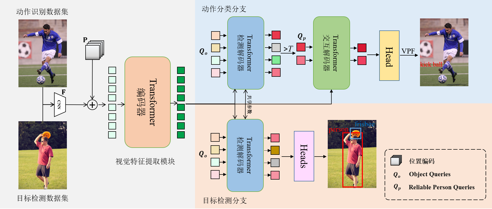

# Disentangled Pre-training for Human-Object Interaction Detection
Zhuolong Li<sup>\*</sup>,
Xingao Li<sup>\*</sup>,
Changxing Ding,
Xiangmin Xu

The paper is accepted to CVPR2024.

<div align="center">
  
</div>

## Preparation

### Environment
1. Install the dependencies.
```
pip install -r requirements.txt
```
2. Clone and build CLIP.
```
git clone https://github.com/openai/CLIP.git && cd CLIP && python setup.py develop && cd ..
```

### Dataset
1. haa500 dataset

&emsp; Download the haa500 dataset from the following URL and unzip it to the `DP-HOI/pre_datasets` folder.
```
http://xxxx
```
&emsp; run `pre_haa500.py`
```
python ./pre_datasets/pre_haa500.py
```
&emsp; Move the processed haa500 dataset to the `DP-HOI/data` folder.

2. kinetics700 dataset

&emsp; Download the kinetics700 dataset from the following URL and unzip it to the `DP-HOI/pre_datasets` folder.
```
http://xxxx
```
&emsp; run `pre_kinetics700.py`
```
python ./pre_datasets/pre_kinetics700.py
```
&emsp; Move the processed kinetics700 dataset to the `DP-HOI/data` folder.

3. flickr30k dataset

&emsp; Download the flickr30k dataset from the following URL and directly unzip it to the `DP-HOI/data` folder.
```
http://xxxx
```
&emsp; Move the processed json file in the `DP-HOI/pre_datasets/train_flickr30k.json` to the `DP-HOI/data/flickr30k/annotations` folder

4. vg dataset

&emsp; Download the vg dataset from the following URL and directly unzip it to the `DP-HOI/data` folder.
```
http://xxxx
```
&emsp; Move the processed json file in the `DP-HOI/pre_datasets/train_vg.json` to the `DP-HOI/data/vg/annotations` folder

5. objects365 dataset

&emsp; Download the objects365 dataset from the following URL and directly unzip it to the `DP-HOI/data` folder.
```
http://xxxx
```
&emsp; Move the processed json file in the `DP-HOI/pre_datasets/train_objects365.json` to the `DP-HOI/data/objects365/annotations` folder

When you have completed the above steps, the pre-training dataset structure is:
```
DP-HOI
 |─ data
 |   └─ coco
 |       |─ annotations
 |       |   |─ trainval_hico.json
 |       |   |─ test_hico.json
 |       |─ images
 |       |   |─ test2015
 |       |   └─ train2015
 
 |   └─ object365
 |       |─ annotations
 |       |   |─ trainval_vcoco.json
 |       |   |─ test_vcoco.json
 |       |   |─ corre_vcoco.npy
 |       |   |─ vcoco_test.json
 |       |   |─ instances_vcoco_all_2014.json
 |       |─ images
 |       |   |─ train2014
 |       |   └─ val2014
 
 |   └─ haa500
 |       |─ annotations
 |       |   |─ test_2019.json
 |       |   |─ train_2019.json
 |       |   |─ obj_clipvec.npy
 |       |   |─ sim_index_hoia.pickle
 |       |   └─ corre_hoia.npy
 |       |─ images
 |       |   |─ test
 |       |   └─ trainval

 |   └─ kinetics700
 |       |─ annotations
 |       |   |─ test_2019.json
 |       |   |─ train_2019.json
 |       |   |─ obj_clipvec.npy
 |       |   |─ sim_index_hoia.pickle
 |       |   └─ corre_hoia.npy
 |       |─ images
 |       |   |─ test
 |       |   └─ trainval

 |   └─ flickr30k
 |       |─ annotations
 |       |   |─ test_2019.json
 |       |   |─ train_2019.json
 |       |   |─ obj_clipvec.npy
 |       |   |─ sim_index_hoia.pickle
 |       |   └─ corre_hoia.npy
 |       |─ images
 |       |   |─ test
 |       |   └─ trainval

 |   └─ vg
 |       |─ annotations
 |       |   |─ test_2019.json
 |       |   |─ train_2019.json
 |       |   |─ obj_clipvec.npy
 |       |   |─ sim_index_hoia.pickle
 |       |   └─ corre_hoia.npy
 |       |─ images
 |       |   |─ test
 |       |   └─ trainval
```

The annotations file,
pre-trained weights and 
trained parameters can be downloaded [here]()

Please download the images at the official website for the datasets above.


### Trained parameters

## Training
After the preparation, you can start the training with the following command.

For the HICO-DET training.
```
python -m torch.distributed.launch \
--nproc_per_node=8 \
--use_env \
main.py \
--pretrained params/detr-r50-pre.pth \
--hoi \
--dataset_file hico \
--hoi_path data/hico_20160224_det \
--num_obj_classes 80 \
--num_verb_classes 117 \
--backbone resnet50 \
--set_cost_bbox 2.5 \
--set_cost_giou 1 \
--bbox_loss_coef 2.5 \
--giou_loss_coef 1 \
```

For the V-COCO training.
```
python -m torch.distributed.launch \
--nproc_per_node=8 \
--use_env \
main.py \
--pretrained params/detr-r50-pre-vcoco.pth \
--hoi \
--dataset_file vcoco \
--hoi_path data/v-coco \
--num_obj_classes 81 \
--num_verb_classes 29 \
--backbone resnet50 \
--set_cost_bbox 2.5 \
--set_cost_giou 1 \
--bbox_loss_coef 2.5 \
--giou_loss_coef 1 \
```

## Fine-tuning
You can convert pre-training parameters to downstream model as follows.


## Results
HICO-DET.
|| Full (D) | Rare (D) | Non-rare (D) | Full(KO) | Rare (KO) | Non-rare (KO) |
| :--- | :---: | :---: | :---: | :---: | :---: | :---: |
|ours (CDN)| 34.27 | 30.02 | 35.54 | 37.05 | 33.09 | 38.23 |
|ours (GEN_s)| 34.40 | 31.17 | 35.36 | 38.25 | 35.64 | 39.03 |
|ours (HOICLIP)| 36.56 | 34.36 | 37.22 | - | - | - |

D: Default, KO: Known object

V-COCO.
|| Scenario 1 | 
| :--- | :---: |
|ours (GEN_s)| 66.2|

## Citation
Please consider citing our paper if it helps your research.
```
@inproceedings{disentangled_cvpr2024,
author = {Zhuolong Li,Xingao Li,Changxing Ding,Xiangmin Xu},
title = {Disentangled Pre-training for Human-Object Interaction Detection},
booktitle={CVPR},
year = {2024},
}
```

## Acknowledgement
[HOICLIP](https://github.com/Artanic30/HOICLIP)
