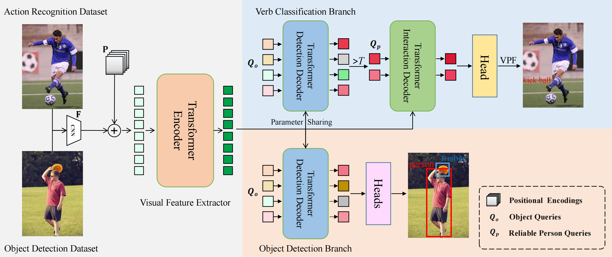

# Disentangled Pre-training for Human-Object Interaction Detection
Zhuolong Li<sup>\*</sup>,
Xingao Li<sup>\*</sup>,
Changxing Ding,
Xiangmin Xu

The paper is accepted to [CVPR2024](https://openaccess.thecvf.com/content/CVPR2024/papers/Li_Disentangled_Pre-training_for_Human-Object_Interaction_Detection_CVPR_2024_paper.pdf).

<div align="center">
  
</div>

## Preparation

### Environment
1. Install the dependencies.
```
pip install -r requirements.txt
```
2. Clone and build CLIP.
```
git clone https://github.com/openai/CLIP.git && cd CLIP && python setup.py develop && cd ..
```

### Dataset
1. HAA500 dataset

&emsp; Download the [Haa500_v1_1](https://www.cse.ust.hk/haa/) dataset and unzip it to the `DP-HOI/data/action` folder.

&emsp; Run `pre_haa500.py`.
```
python ./pre_datasets/pre_haa500.py
```

2. Kinetics700 dataset

&emsp; Download the [Kinetics700](https://deepmind.com/research/open-source/kinetics) dataset and unzip it to the `DP-HOI/data/action` folder.

&emsp; Run `pre_kinetics700.py`.
```
python ./pre_datasets/pre_kinetics700.py
```

3. Flickr30k dataset

&emsp; Download the [Flickr30k](https://huggingface.co/datasets/nlphuji/flickr30k) dataset from the following URL and directly unzip it to the `DP-HOI/data/caption` folder.

4. VG dataset

&emsp; Download the [VG](https://homes.cs.washington.edu/~ranjay/visualgenome/index.html) dataset from the following URL and directly unzip it to the `DP-HOI/data/caption` folder.

&emsp; Download and unzip the processed [annotations.zip](https://drive.google.com/file/d/1IotuJxE8-XXrgQng_TuOSRvDGWKGA8p4/view?usp=sharing) to `DP-HOI/data/caption/annotations` folder.

5. Objects365 dataset

&emsp; Download the [Objects365](https://www.objects365.org/overview.html) dataset from the following URL and directly unzip it to the `DP-HOI/data/datection` folder.

6. COCO dataset

&emsp; Download the [COCO](https://cocodataset.org/#home) dataset from the following URL and directly unzip it to the `DP-HOI/data/datection` folder.

&emsp; Download and move the processed [coco_objects365_200k.json](https://drive.google.com/file/d/1uGvxgL-uaIu9iLcnGazaBIJ5fTpKHqbs/view?usp=sharing) to the `DP-HOI/data/detection/annotations` folder.

When you have completed the above steps, the pre-training dataset structure is:
```
DP-HOI
 |─ data
 |   └─ action
 |     └─ haa500  
 |       |─ annotations
 |       |   |─ train_haa500.json
 |       |─ images
 |       |─ videos
 |     └─ kinetics-700  
 |       |─ annotations
 |       |   |─ train_kinetics700.json
 |       |─ images
 |       |─ videos

 |   └─ caption
 |     └─ annotations
 |       |─ Flickr30k_VG_cluster_dphoi.json
 |       |─ triplets_category.txt
 |       |─ triplets_features.pth
 |     └─ Flickr30k  
 |       |─ images
 |     └─ VG
 |       |─ images
 
 |   └─ detection
 |     └─ annotations
 |       |─ coco_objects365_200k.json
 |     └─ coco  
 |       |─ images
 |       |─ annotations
 |       |   |─ instances_val2017.json
 |     └─ objects365
 |       |─ images
```

### Initial parameters
To speed up the pre-training process, consider using DETR's pre-trained weights for initialization. 
Download the [pretrained model](https://dl.fbaipublicfiles.com/detr/detr-r50-e632da11.pth) of DETR detector for ResNet50 , and put it to the `params` directory.


## Pre-training
After the preparation, you can start training with the following commands.
```
sh ./scripts/pretrain/train.sh
```

## Fine-tuning
After pre-training, you can start fine-tuning with the following commands. An example of fine-tuning on HOICLIP is provided below.
```
python ./tools/convert_parameters.py \
        --finetune_model hoiclip \
        --load_path params/dphoi_res50_3layers.pth \
        --save_path params/dphoi_res50_hico_hoiclip.pth \
        --dataset hico \
        --num_queries 64 
sh ./scripts/finetune/hoiclip/train_hico.sh
```

## Pre-trained model
You can also directly download the pre-trained [model](https://drive.google.com/file/d/1DYBY8wHDGDPh9pyvxBewTqmpbztAzazb/view?usp=sharing) of DP-HOI for ResNet50.

## Results
### HICO-DET
| | Full (D) | Rare (D) | Non-rare (D) | Model | Config
| :--- | :---: | :---: | :---: | :---: | :---: |
| ours (UPT) | 33.36 | 28.74 | 34.75 | [model](https://drive.google.com/file/d/11JkfTQkMv7C54NJYnCwK_icHA5ZJiYSo/view?usp=sharing) | [config](https://github.com/xingaoli/DP-HOI/blob/main/scripts/finetune/upt/train_hico.sh)
| ours (PViC) | 35.77 | 32.26 | 36.81 | [model](https://drive.google.com/file/d/1M_mxcyYTrUtM-mR_Wz8RoTwZedLmFU6j/view?usp=sharing) | [config](https://github.com/xingaoli/DP-HOI/blob/main/scripts/finetune/pvic/train_hico.sh)
| ours (CDN-S<sup>†</sup>) | 35.00 | 32.38 | 35.78 | [model](https://drive.google.com/file/d/1_FFccjgxMvuo3aXacZSBc77CPcDDrDdv/view?usp=sharing) | [config](https://github.com/xingaoli/DP-HOI/blob/main/scripts/finetune/cdn/train_hico_cdn_dn.sh)
| ours (CDN-S<sup>†</sup>+CCS<sup>*</sup>) | 35.38 | 34.61 | 35.61 | [model](https://drive.google.com/file/d/1nZEcIqL_iMn44-The7bb9PAGtUu5Uz3-/view?usp=sharing) | [config](https://github.com/xingaoli/DP-HOI/blob/main/scripts/finetune/cdn/train_hico_cdn_dn%20ccs.sh)
| ours (HOICLIP) | 36.56 | 34.36 | 37.22 | [model](https://drive.google.com/file/d/1Y6ay5jxZQHRZ9Yr_cASAT98aTxu6vk9B/view?usp=sharing) | [config](https://github.com/xingaoli/DP-HOI/blob/main/scripts/finetune/hoiclip/train_hico.sh)

D: Default, †: DN strategy from [DN-DETR](https://github.com/IDEA-Research/DN-DETR), *: data augmentation strategy from [DOQ](https://github.com/SherlockHolmes221/DOQ). 
The weights fine-tuned on HICO-DET for two-stage methods (e.g., UPT and PViC) can be download [here](https://drive.google.com/file/d/1IotuJxE8-XXrgQng_TuOSRvDGWKGA8p4/view?usp=sharing).

### V-COCO
| | Scenario 1 | Model | Config
| :--- | :---: | :---: | :---: |
| ours (GEN<sub>s</sub>) | 66.6 | [model](https://drive.google.com/file/d/1Kr4TyCbcfhh5s3u5dWjsFfgg1ED9ODDe/view?usp=sharing) | [config](https://github.com/xingaoli/DP-HOI/blob/main/scripts/finetune/gen-vlkt/train_vcoco.sh)

### Zero-shot HOI Detection Results
| | Type | Unseen | Seen | Full | Model | Config
| :--- | :---: | :---: | :---: | :---: | :---: | :---: |
| ours (HOICLIP) | UV | 26.30 | 34.49 | 33.34 | [model](https://drive.google.com/file/d/1RaF4-cGuHeBL9pAX3m-npFLM6O5WTBj9/view?usp=sharing) | [config](https://github.com/xingaoli/DP-HOI/blob/main/scripts/finetune/hoiclip/train_hico_uv.sh)
| ours (HOICLIP) | RF-UC | 30.49 | 36.17 | 35.03 | [model](https://drive.google.com/file/d/1HLAgzFAup8riHKLAKlWFhntcKatF5TCt/view?usp=sharing) | [config](https://github.com/xingaoli/DP-HOI/blob/main/scripts/finetune/hoiclip/train_hico_rf_uc.sh)
| ours (HOICLIP) | NF-UC | 28.87 | 29.98 | 29.76 | [model](https://drive.google.com/file/d/1Xn5Eq11QtTSskhoxe7_Z3XsbZ-6x0mwk/view?usp=sharing) | [config](https://github.com/xingaoli/DP-HOI/blob/main/scripts/finetune/hoiclip/train_hico_nrf_uc.sh)

## Citation
Please consider citing our paper if it helps your research.
```
@inproceedings{disentangled_cvpr2024,
author = {Zhuolong Li,Xingao Li,Changxing Ding,Xiangmin Xu},
title = {Disentangled Pre-training for Human-Object Interaction Detection},
booktitle={CVPR},
year = {2024},
}
```

## Acknowledgement
Codes are built from [DETR](https://github.com/facebookresearch/detr), [DN-DETR](https://github.com/IDEA-Research/DN-DETR), [CLIP](https://github.com/openai/CLIP). We thank them for their contributions.
